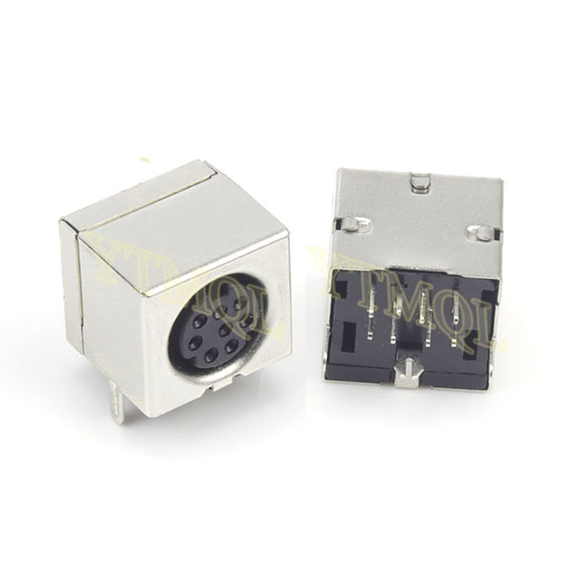
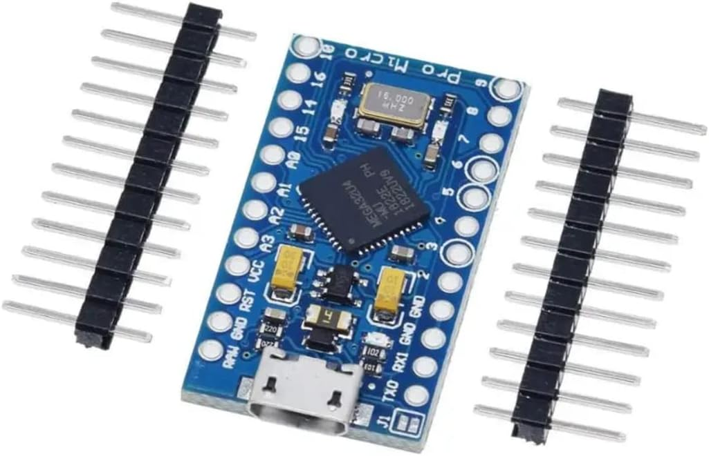
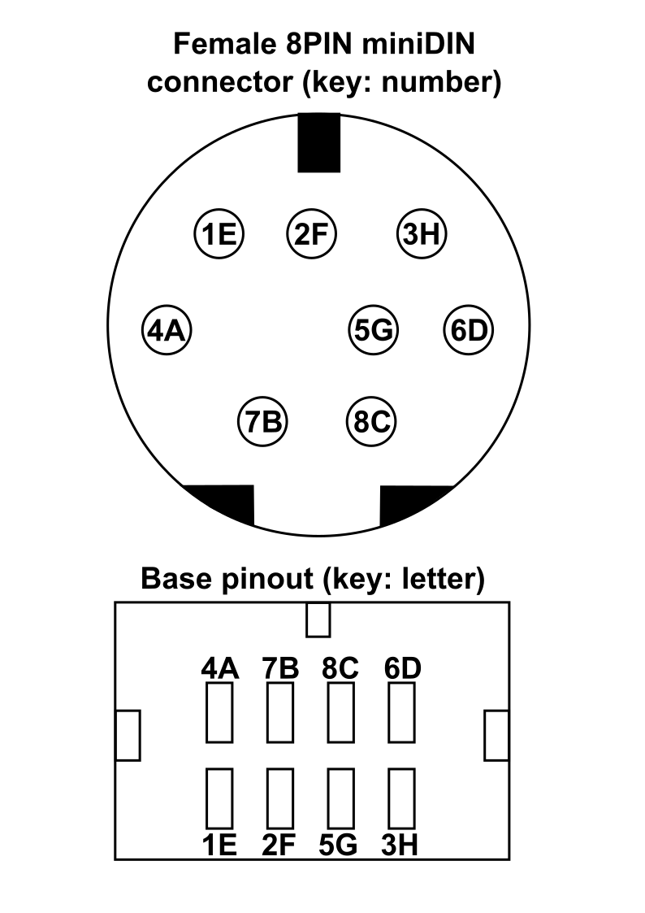

# Sun2UsbAdapter
Adapter for using Sun Keyboards (4/5/6) as USB devices, with macro support, using the excellent [Alexander Vollschwitz's suniversal adapter](https://codeberg.org/xelalexv/suniversal). This repo includes the specific pinout for the OEM 8pin
connector, and how to wire it to the arduino pro micro (clone).

** NOTE ** added support for the sun mouse without electronics. just use the `suniversal_reversed` code in the `dev` folder. The serial logic is inverted, so the mouse works properly. Uses the [AltSoftSerial](https://github.com/PaulStoffregen/AltSoftSerial) library to manage the serial port using custom ports. Check the documentation (specific pins are hardcoded in the library based on arduino's model)

## Parts

[Cheap Ebay 8Pin MiniDin](https://es.aliexpress.com/item/1005004227811305.html?spm=a2g0o.order_detail.order_detail_item.4.69bd39d3pFY9NK&gatewayAdapt=glo2esp), model N8Pin (3,60€ / 5 units).

</img>

[Ardunio Micro Clone](https://www.amazon.es/ATmega32U4-Compatible-Arduino-Gen%C3%A9rica-incluidos/dp/B0C4TQM3T5/ref=sr_1_3_sspa?keywords=Arduino+Micro&qid=1688457493&sr=8-3-spons&sp_csd=d2lkZ2V0TmFtZT1zcF9hdGY&psc=1) Any model will work.

</img>

## Connector Pinout and wiring

After reverse engineer the wiring, I get the following
table:

</img>

| **Connector PIN** | **Base PIN** | **Wiring color** | **Description** | **Arduino PIN** |
|-------------------|--------------|-----------------:|-----------------|-----------------|
| 1                 | E            | Red              | VCC +5V         |             VCC |
| 2                 | F            | White/Black      | -               |                 |
| 3                 | H            | Green            | From Keyboard   |        D10 (RX) |
| 4                 | A            | White            | To Keyboard     |         D9 (TX) |
| 5                 | G            | Black            | From Mouse      |                 |
| 6                 | D            | Yellow           | VCC +5V         |                 |
| 7                 | B            | Yellow/Black     | GND             |             GND |
| 8                 | C            | Grey             | GND             |                 |

## Software Install

See the guide on [Alexander Vollschwitz's suniversal adapter](https://codeberg.org/xelalexv/suniversal). Just download the sketch, select your board (arduino micro or leonardo) and download it. Just edit the
`config.h` file and select your options (mine where don't use mouse, and don't debug). NOTE (31/05/2024) I manage to map the keys to the right Windows key usage, except the
volume mute, volume up and volume. down. To fix that, I map MUTE to F13, DOWN to F14 and UP to F15, and with the powertoys [Microsoft PowerToys](https://learn.microsoft.com/es-es/windows/powertoys/install#installing-with-microsoft-store) I start the keyboard manager, and add remaps for the F13, F14 and F15 keys to the system commands).
. NOTE (31/05/2024) I manage to map the keys to the right Windows key usage, except the
volume mute, volume up and volume. down. To fix that, I map MUTE to F13, DOWN to F14 and UP to F15, and with the powertoys [Microsoft PowerToys](https://learn.microsoft.com/es-es/windows/powertoys/install#installing-with-microsoft-store) I start the keyboard manager, and add remaps for the F13, F14 and F15 keys to the system commands).